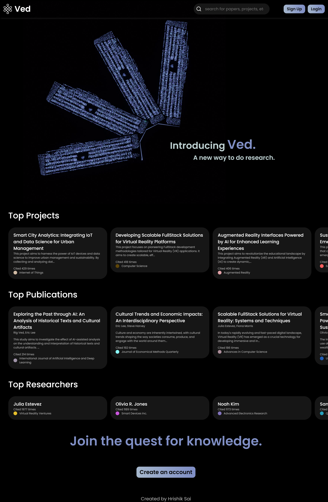
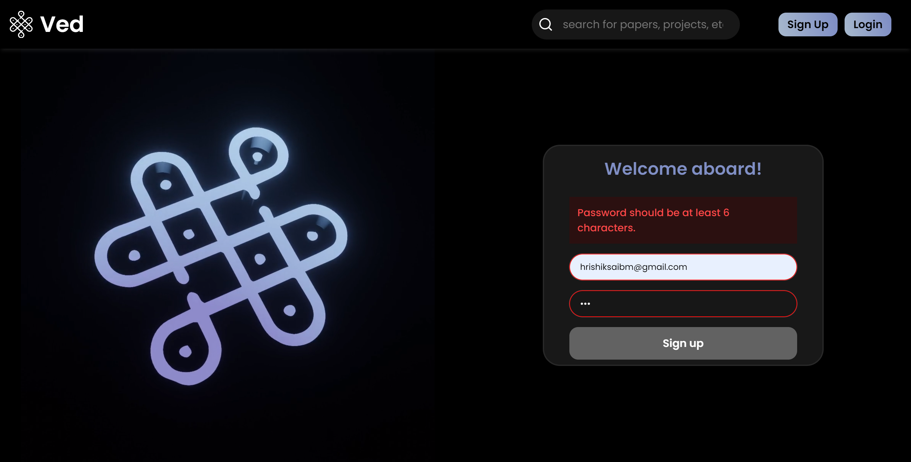
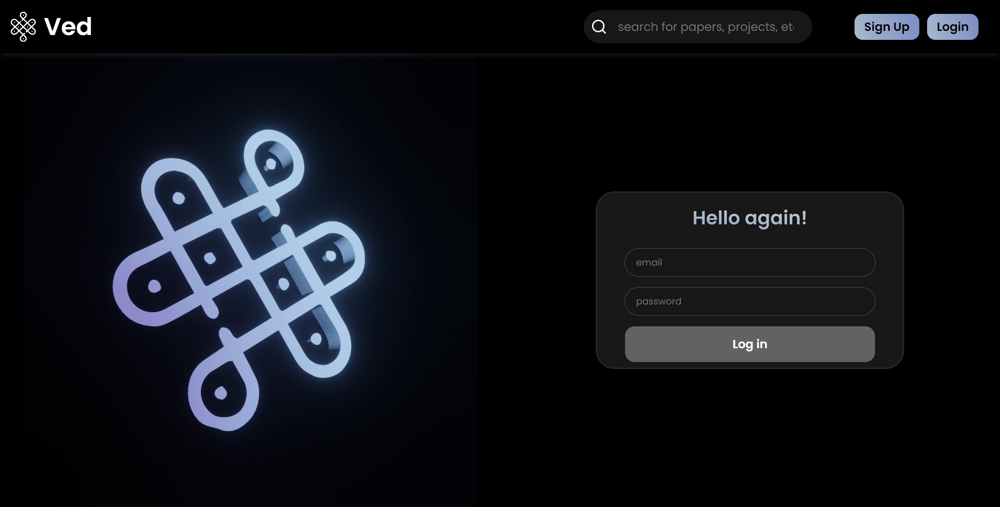
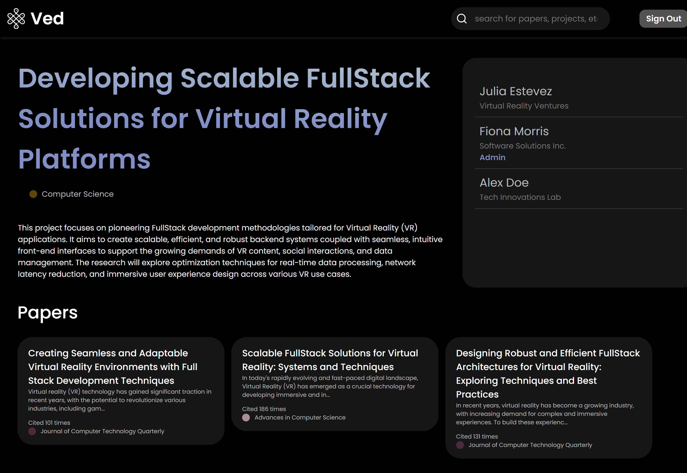
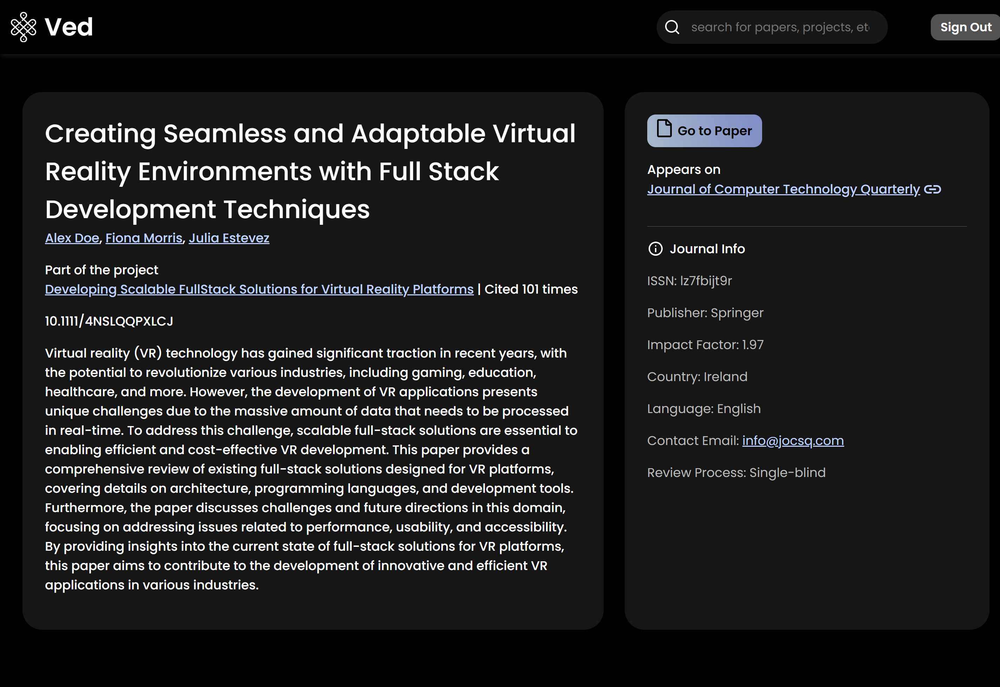
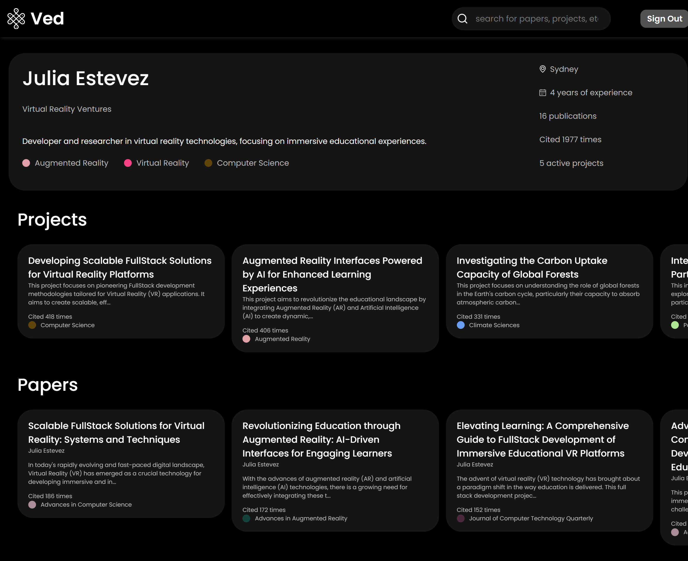
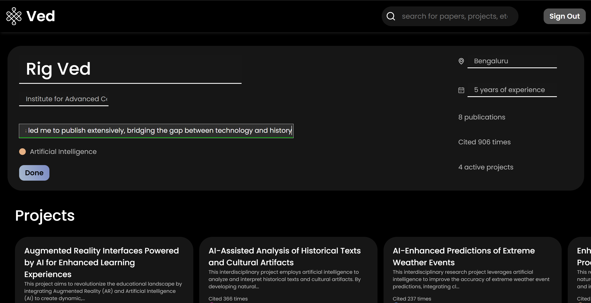
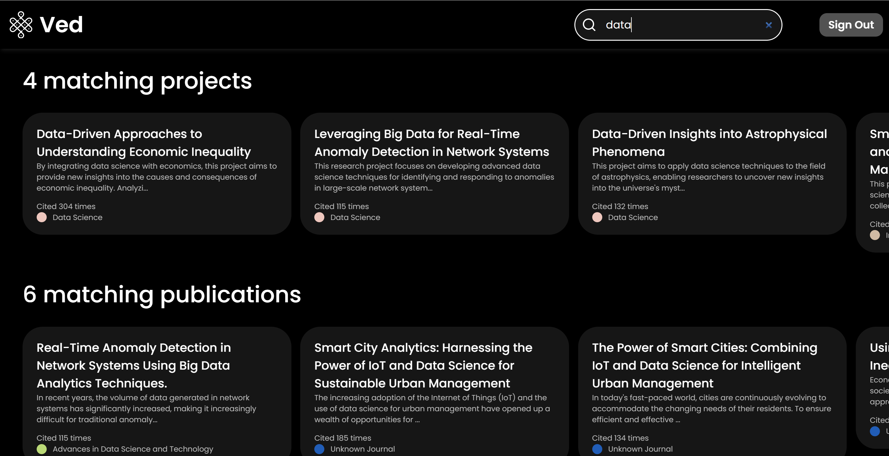
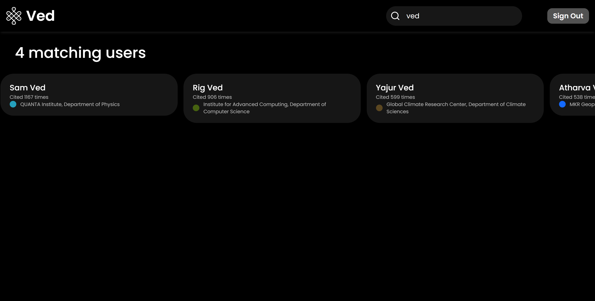
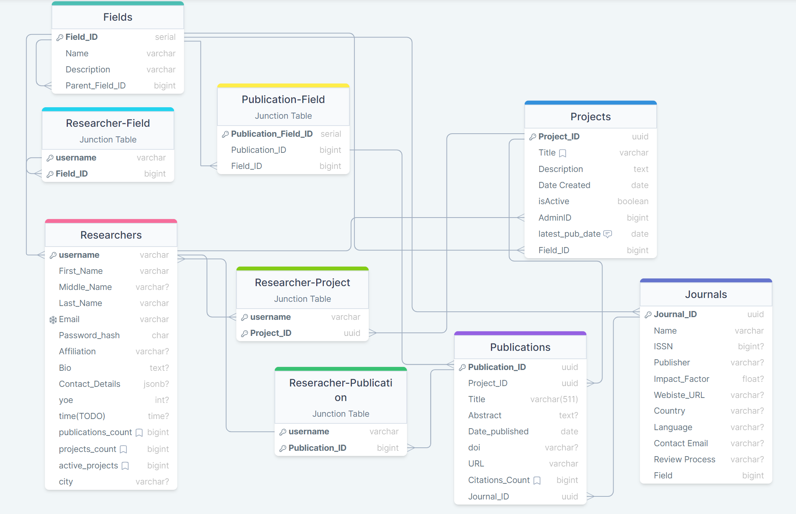

# Ved: A Project for Research Collaboration

Ved is a student project aimed at promoting research collaboration. It is intended to serve as a platform where users can browse and interact with various research projects, papers, and authors.

# Screenshots

Here are some screenshots of the application in action:

### Home Page

The home page of the application, showing the top projects, publications and papers. It also showcases a video graphic that moves upon scroll.

### Sign Up Page

The sign up page of the application, displaying an error message when there is an issue with the user's input.

### Login Page

The login page of the application, where users can enter their credentials to access their account.

### Project Page

A detailed view of a single project, including project details, contributors, and constituent publications.

### Publication Page

A detailed view of a single publication, including the abstract, citation count, and journal details.

### User Page

A profile page for each user, displaying their information, projects, and publications.

### Editing your User Page

A page where users can edit their profile information, including their name, bio, profile picture, and contact details.

### Search Results

A page displaying the search results based on the user's query. It shows a list of projects, publications or users that match the search criteria.

## Technical Details

Here are some technical details about the application:

- The project UI was designed using Figma.
- The application is built using React.
- The database used in this project is Postgres, which is accessed via the Supabase API that also serves as the backend service.
- The application supports basic authentication, allowing users to create an account, log in, and log out.
- CRUD operations are supported, allowing users to create new projects, view project details, update user information, and delete projects.
- The application includes a search functionality, enabling users to easily find specific projects or other users.

## Database Schema

Here is the schema diagram of the database used in the application:

